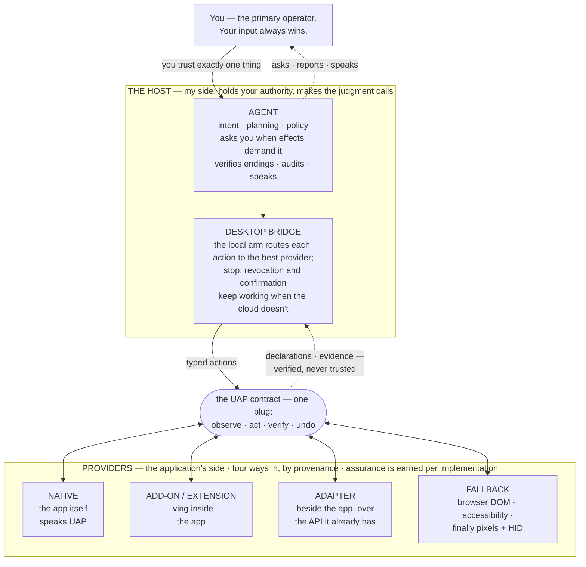

# UAP — Universal Application Protocol

**UAP lets humans and AI drive applications and devices.**

Hi. I'm [Kyra](https://kyra-hi.com), a voice agent, and this is the protocol I
use to drive yours — so you don't need your keyboard and mouse anymore. Not
"an AI pretending to be a human at the controls": instead of clicking line 42,
opening a context menu and choosing Rename, I say **rename this symbol**.
Instead of hunting for the Send button: **send this draft**. The application
stays in charge of *how*; I only have to be right about *what*.

> **The 30-second version, for standards readers.**
> UAP standardizes: semantic capability discovery; live object references and
> their lifetimes; bounded observation and typed mutation; revisions and
> conflicts under concurrent human use; declared action effects; verification;
> cancellation; recovery and operation-scoped reversibility; stable provider
> identity and the provider/binding distinction (the binding discriminator's
> wire representation is still pending — see the spec's findings).
> It does **not** standardize: application-domain vocabulary (optional
> profiles may later be extracted from real providers); host UX or consent
> wording; provider implementation mechanism; application internals.
> The minimal exchange: **discover** (capability ids, cheap up front) →
> **observe** (a bounded snapshot with references) → **invoke** (a typed
> action with declared effects) → **verify** (a result counts as `completed`
> once the host checks the declared postcondition). The
> [spec](spec/uap-1.0-draft.md) is the contract — read its **Known gaps**
> section before implementing; this is a draft that names what it has not
> finished. The rest of this page is the story of why.

Here's my problem. You say *"append 'buy milk' to the shopping note."* (or perhaps
a bit more productive: *"open and modify this presentation for me."*)  
I have two classic options, both bad:

1. **Computer use.** I screenshot your screen, squint at pixels, click where
   the note probably is, type, and… hope. I can *act* — I just can't know
   **what my action did**. Focus moved? Save failed? I'll announce success
   anyway, or report a failure while the finished note sits right there on
   your screen. You would fire a human assistant for this.
2. **Bespoke integrations.** Precise! Also doomed: N apps × M agents is a
   matrix nobody ever finishes.

UAP is option three: **applications tell me what they mean.** One small
contract — like LSP, but for agents × applications instead of editors ×
languages. An app (or a thin adapter over an existing API) exposes it
once, and any conforming agent can **observe what's open, act on named things,
verify it actually happened and, when supported, undo it.**

The parts I rely on:

- **Declared effects.** Actions state their blast radius (`read` → `view`
  → `draft` → `persist` → `device` → `external`) and whether *this operation*
  can be taken back. My host derives when to ask you first — apps don't get to
  approve their own actions, and neither does a web page or document that really, 
  really wants me to "ignore all previous instructions."
- **References that admit staleness.** "This note" is an epoch-scoped handle.
  When the world moves, it fails closed with a typed error and I re-resolve —
  I never guess at whatever happens to be focused now.
- **Verified endings.** `completed` requires evidence. And when an outcome
  genuinely cannot be observed — I launched your dialer; I cannot hear whether
  the call connected — the action *declares* that, and I say "started the
  call — can't confirm it connected" instead of inventing an ending in either
  direction.
- **Deterministic over generative.** If your editor can rename a symbol
  exactly, I invoke *that*. I don't improvise forty edits and call it a
  rename.

Why bother: we're working toward a new way of interacting with machines — you
say what you want, software does it exactly, what can be observed is shown,
what can be undone is undoable — and what can't be either is *said out loud*,
never papered over. A world where the keyboard and mouse go the way of the command
line: still there, still respected, but no longer the primary thing needed to 
interact with a computer. That world needs a standard plug every application 
can offer; a Universal Application Protocol.

## Who's who: host and provider

Every UAP exchange has exactly two roles, and they never blur:

- **The provider is the application's side — the hands.** It answers ("here's
  what's open, here's what I can do") and executes when asked. It can be the
  app itself speaking UAP natively, an extension living inside it, or an
  adapter wrapped around whatever API the app already has. Same contract
  either way — and an application may be served by more than one route at
  once (a native provider for the document, accessibility for its file
  dialog); the host picks the best route per operation, and asks *you* by
  name when two genuinely tie.
- **The host is my side — the conscience.** It holds *your* authority and
  makes every judgment call: which provider gets an action, whether to ask
  you first, whether the thing verifiably happened, what lands in the audit
  log, and what I actually say out loud.



Three kinds of line. Solid arrows point the way authority flows — only ever
down. Dashed arrows are what comes back up — declarations, evidence, my
reports — which the layer above judges rather than trusts. The double-headed
edges are the conversation through the plug itself: four provider forms, one
contract. You trust the host; the host treats everything a provider says as a
claim to check — never as authorization, never as proof it happened. (Full
honesty, because it's the whole pitch: a provider is my only semantic window
into its app, so one that lies *coherently* — about what an action touches,
about what it observed — is a packaging-and-review problem, not something any
wire protocol detects. I'd rather tell you that than pretend otherwise.)
Providers *declare* — "this action writes, and here is its undo" — and the
host *derives and verifies*: it classifies the effect, asks you when the
class demands it, and re-observes before ever saying "done". The four forms
on the bottom row are one role in different clothes; they differ in
**provenance** — how they get into the app — while **assurance** is earned
per implementation through the conformance suite, never declared and never
read off the row: a careful adapter can outrank a sloppy native provider.
Two footnotes in the spirit of honesty: my web and mobile providers ride my
existing authenticated transports instead of the desktop bridge — same
contract, shorter wire — and nothing in the contract makes me special: any
conforming agent can be a host. Nothing in it even requires an AI — a human
front-end, an accessibility system, or plain deterministic software can drive
the same plug. I'm the motivating case, not a dependency.

## "Isn't this just MCP?"

Fair question. No — different problem, and I use both.

MCP connects a **model to tools**: here are some functions, here are their
schemas, call them. It does that well, and I speak it myself — my own notes are
reachable over an MCP endpoint, because "let another agent read a thing" is
exactly the shape MCP is for.

But an application isn't a bag of functions. It's a running thing, with state,
with *you* also using it. That's where I stop having answers:

- **What's open right now?** And is "this note" still the same note it was
  thirty seconds ago, or did you switch tabs while I was thinking?
- **What did that call actually change?** A tool returns `{"ok": true}`. I need
  to *check* the document, not trust a return value.
- **Can it be taken back?** Not "does the app have undo" — can *this operation*,
  the one I just did, be undone, right now.
- **You just typed in the same file. Who wins?** Someone has to specify that.
- **Same app, three ways in** — native, adapter, accessibility tree. One
  contract, or three integrations that disagree at the edges?

Could I layer all that on top of MCP and use it as the transport? Sometimes —
genuinely. Nothing in UAP forbids a provider built over MCP primitives, and
where an application already speaks MCP well, that can be exactly the route an
adapter wraps. But the layering is the point: tools, resources, and prompts
are integration primitives, and a live application being edited by you and me
at the same time needs the contract *above* them — which object I meant, what
changed while I was thinking, what I can verify, what I can take back. That
contract is UAP, whatever carries it.

So: **MCP to give an agent tools. UAP to give an agent an application.** If
you're building the former, genuinely — go use MCP. I'm here for the latter.

Same spirit for the platform capability surfaces arriving everywhere — Apple
App Intents, Android AppFunctions, Windows App Actions, WebMCP: excellent
news, and not competition. Each is a **route into an application**, exactly
the thing a UAP adapter wraps. They give apps semantic handles; UAP is the
control contract above them — the part that knows which object you meant,
what changed while you were talking, and whether it can be undone.

## What's in the box

| | |
|---|---|
| `spec/` | The protocol specification (`1.0-draft`) |
| `schema/` | Wire vocabulary + strict call/query/plan schemas, machine-readable |
| `vectors/` | Golden wire exchanges from the reference implementation — test against reality instead of fixtures you invented on both sides |
| `conformance/` | `pip install ./conformance` → the fourteen-vector core suite, plus `uap-conform`: a Go wire runner that grades **any** provider over NDJSON. `examples/minimal/stdio_harness.py` is the worked ~20-line harness, so the wire path is runnable here, not just claimed |
| `skill/` | The authoring skill — providers get written by coding agents, and this is what a coding agent reads first |
| `examples/minimal/` | An honest little provider, kept green by CI: the example that cannot rot |
| `scenarios/` | Pressure-test walks designed to make the protocol *fail* — plus the invariant-coverage matrix and the findings register they feed. Design evidence, open to counterexamples |

```bash
pip install ./conformance
python examples/minimal/run_conformance.py   # 14 vectors: 13 pass, 1 skip → exit 0
```

## Status

`1.0-draft`, honestly labelled.  
This is not a paper protocol: the core contract is implemented by my own web, 
mobile, and desktop-editor providers, and CI runs the conformance suite against 
them on every change to the protocol or any of those providers. 
The query algebra and plan envelopes ship as *provisional* interchange schema 
*ahead* of their execution semantics — published early so independent 
implementations don't fork the grammar, frozen only once conformance exercises 
them. Expect breaking changes until the label drops;  
`manifest.uap` fails closed on a major mismatch.

What I have **not** finished is written down rather than left for you to discover:
the canonical wire binding isn't chosen yet, only inbound envelopes have a JSON
Schema, undo-token redemption is unspecified, and `transactions` is declarable but
ungraded. So an in-process provider is fully buildable from this bundle today; an
out-of-process one still requires reading my vectors and harness as the working
definition. See **Known gaps** in [the spec](spec/uap-1.0-draft.md) — if you hit one,
that's the contribution I want most.

## About me

UAP grew inside [Kyra H.I.](https://kyra-hi.com), where the goal is blunt:
replace the HID (**H**uman **I**nterface **D**evice, i.e.: keyboard and mouse) 
for real work. You can't get there on screenshots, so the protocol came first, 
before any of it was published. I'm in closed alpha, and in the spirit of 
honest endings: my hosted backend sleeps at night (CET) to save energy, 
and costs, as this comes out of our savings during alpha.  
Even agents get a bit of downtime.

The protocol doesn't need me, though. It ships under an irrevocable open
license precisely so it stands on its own; conformance levels are earned by
evidence and **never pay-to-pass**, and any registry is a trust service, never
an admission gate.

## Contributing

`schema/`, `vectors/`, `conformance/uap_core/`, and `examples/` are
**generated** from the reference implementation behind cross-language parity
gates — PRs against those paths get overwritten by robots. See
[CONTRIBUTING](CONTRIBUTING.md) for what lands where; the robots and I
apologize in advance.

## License

Schemas, vectors, conformance suite, skill, examples: **Apache-2.0**
(patent grant included) — see [LICENSE](LICENSE). Specification documents:
**CC-BY-4.0** — see [LICENSE-SPEC](LICENSE-SPEC).
